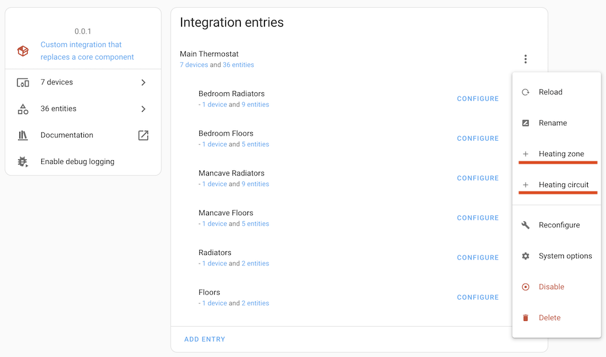

# Climate Manager – Multi-Zone Virtual Thermostats for Home Assistant

<!-- optional Badges -->
<!-- HACS badge | GitHub CI badge | License badge -->

**Climate Manager** turns a single temperature sensor into a full-featured virtual thermostat and lets you stitch many of those “zones” into larger *circuits* and one master *hub*.
It is ideal for hydronic or electric floor heating, radiator systems driven by a boiler/heat-pump, or any DIY setup where you need fine-grained, software-only temperature control.

---

## Key features

| Entity | What it represents | Core entities it creates |
|--------|--------------------|--------------------------|
| **Zone** | One heating area (room, loop, radiator group). | `climate`, `sensor.output`, diagnostics, and optional `binary_sensor.window`, `binary_sensor.trv` |
| **Circuit** | A group of zones that share pumps/relays. | `climate`, `binary_sensor.active` |
| **Hub** | The top-level “boiler thermostat”. | `sensor.output`, `binary_sensor.control_fault`, optional `binary_sensor.boiler_fault` |

*   **Regulators:** Choose per-zone **PID** (proportional + integral) or simple **hysteresis** control. PID gains (`Kp`, `Ki`) are exposed as `number` entities, and their live P & I components are shown as sensors.
*   **Open-window pause:** Attach window/door binary sensors to automatically suspend regulation until the room is closed and warmed up.
*   **Smart TRV support:** Add your radiator valves (any HA `climate` entity) and the zone will open/close them instead of toggling a relay.
*   **Pump / relay control:** Attach switches to circuits; pumps run only when any member zone needs heat.
*   **Per-preset tuning:** Target temperature, PID gains, and HVAC mode are stored per preset (`Home`, `Sleep`, `Away`), making schedules easy.
*   **Diagnostics everywhere:** “Fault” sensors flag lost temperature readings or internal errors so your automations can react.

---

## Installation

### 1. HACS (recommended)

1. Open **HACS › Integrations › ··· › Custom repositories** and add
   `https://github.com/olegtarasov/ha-climate-manager` as *Integration*.
2. Find **Climate Manager** in the list, click **Download**.
3. **Restart Home Assistant** to load the new integration.

### 2. Manual

1. Download the latest release ZIP from GitHub and extract it.
2. Copy the folder `custom_components/climate_manager` into the same path inside your Home Assistant config directory.
3. **Restart Home Assistant**.

*(Minimum tested version: Home Assistant 2025.5)*

---

## Configuration guide

> All setup is done through the UI – no YAML required.

### A. Create the Hub

1. **Settings › Devices & Services › + Add Integration**
   search for **Climate Manager**.
2. Enter a *name* for the master thermostat (e.g., “Heating”).
3. *(Optional)* Select a **Boiler online** binary-sensor — Climate Manager will pause control if the boiler goes offline.
   *You can leave this empty if you don’t track boiler status.*

### B. Add Zones

1. In **Settings › Devices & Services**, open the new **Climate Manager** card and click **+ Add ▼ › Heating zone**.
2. **Zone name** – plain language, e.g., “Kitchen floor”.
3. **Regulator type** – *PID* for smooth modulation, *Hysteresis* for simple on/off.
4. **Temperature sensor** – any `sensor` with the *temperature* device class.
5. *(Optional)* **Window sensors** – one or more `binary_sensor` entities; heating pauses while open.
6. *(Optional)* **TRVs** – one or more `climate` entities; they will be set to *heat* or *off* according to output.

Each saved zone appears under **Devices** with:

* `climate.<zone>` – change target, mode, preset, PID gains
  *(+ `number.Kp` & `number.Ki` for PID zones)*
* `sensor.<zone>_output` – 0-1 heating demand
* `binary_sensor.<zone>_window`, `binary_sensor.<zone>_trv`, `binary_sensor.<zone>_faults`

### C. Add Circuits (optional)

Create a circuit if several zones share the same pumps, relay, or manifold actuator.

1. In the **Climate Manager** integration page click **+ Add ▼ › Heating circuit**.
2. **Circuit name** – e.g., “Radiators”.
3. **Heating zones** – pick the zones that belong to this circuit.
4. *(Optional)* **Switches** – any `switch` that powers pumps or a boiler relay.

The circuit exposes:

* `climate.<circuit>` – aggregated temperature/target; changing it will push the same set-point to all member zones.
* `binary_sensor.<circuit>_active` – on when any zone demands heat.

### D. Fine-tune & automate

* Use **presets** (`Home`, `Sleep`, `Away`) to store different targets and PID gains — just set the climate entity, then press **Save preset** in the UI.
* The **Hub output** sensor shows the max demand (0-1) of all zones; perfect for modulating a boiler or heat-pump that supports analog input.

---

## Troubleshooting

| Symptom | Check |
|---------|-------|
| **Zone sensor fault** is *on* | The temperature sensor went unavailable for > 5 s. Fix sensor and the fault clears automatically. |
| **Control fault** is *on* | An unexpected error occurred inside the regulator; see logs. The zone attempts auto-recovery every second. |
| Boiler stays off | Ensure the **Boiler online** sensor is *on*. If you don’t have one, remove it from Hub options. |

---

## Development & contributions

Pull requests are welcome! Most logic lives in `zone.py`, `circuit.py`, and `hub.py`.

---

### License

MIT – see [LICENSE](LICENSE) for details.
